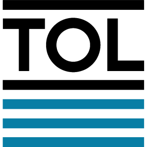
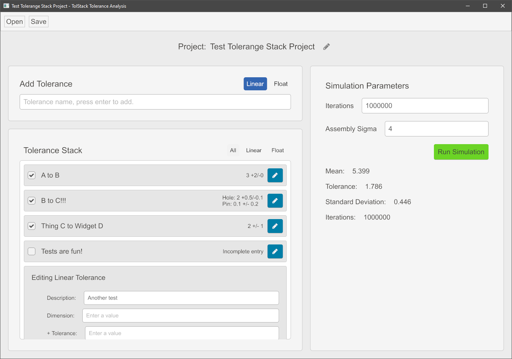

  
   
  <b>This application is in development, untested, unstable, and not ready for general use.</b>

## Overview

Tolstack is a tolerance analysis application for building and analyzing 1D geometric tolerance models. The goal of this tool is to make tolerance stackup analysis fast, easy, and error free. Built as a learning project with Rust using [`iced`](https://github.com/hecrj/iced).

### Tolerance Analysis

[Tolerance analysis](https://en.wikipedia.org/wiki/Tolerance_analysis) is used in Mechanical Engineering to quantify the accumulated dimensional variation in assemblies of parts. This is used to define part tolerances, and later verify that manufacturing processes are statistically capable of producing parts to this tolerance spec. Generally, the goal is to specify the widest possible tolerances to minimize scrap ($$$) while ensuring any combination of parts within these tolerances still fit together and function. GD&T (ASME Y14.5) is commonly used as the languge to express three-dimensional tolerances.

This application does not attempt to model all of the tolerances in your assembly, rather, this is a tool to help you model and understand critical tolerance stacks in one dimension. This greatly simplifies the modelling process and generally makes for much clearer, actionable, output. To construct a 1D model, you will need to:

1. Determine the target measurement you want to evaluate.
2. Define an axis to project this measurement onto (often times you can just project onto a plane).
3. Define the positive and negative directions along your axis - this is very important!
4. Determine the chain of dimensions needed to define the stackup that results in your target measurement.
5. Using this chain of dimensions, record the dimensions and tolerances as projected on your axis, making sure the signs are correct.

### Use Cases

One-dimensional tolerance analysis is useful for answering questions like:
* Will this sandwich of plastic parts and PCBs fit into my enclosure 99.99% of the time?
* When I depress this button, will I make electrical contact with the switch before it bottoms out?
* Knowing the dimensional tolerances of some purchased components, what tolerances must I set for the assembly to function?

## Build Instructions

1. Clone the repository.
2. Install Rust via [Rustup](https://www.rust-lang.org/tools/install).
3. From the root directory, run `cargo run --release` to build and launch the application with compiler optimizations.

## Features

### Tolerance Stack Model

* `Linear`: Linear dimensions (point A to B with some tolerance)
* `Float`: Represents a connection between parts with a hole/pin pair
* Supports unequal bilateral tolerances (+0.2/-0.1)

### Analysis

* Monte Carlo simulation
* Worst case stackup
* WIP: ~~RSS~~
* WIP: ~~Hole-pin connections in parallel~~

### Output

* Auto saving
* WIP: ~~Manually save/load JSON project files~~
* WIP: ~~Export results to CSV~~

## Roadmap

### v0.1

- [x] GUI for building tolerance model
- [X] Make computation function async
- [X] Add simulation parameter controls
- [X] Refactor code structure to make extension easier
  - [X] Break out UI widgets into using own internal structure to greatly simplify the top `view()` function
  - [X] Consolidate/simplify ToleranceType matching
  - [X] Remove redundant SimulationResult, use result in the SimulationState
- [X] Implement unequal bilateral tolerances in GUI
- [X] Add sigma input on tolerance entries
- [X] Add hole/pin diameter input on `Float` entries
- [X] Show tolerance summary on entries in idle state
- [ ] Ribbon menu bar
  - [ ] Autosave toggle
  - [X] Save/Open project
  - [ ] Save As project
  - [ ] Export
  - [ ] Button icons
- [ ] CSV Export (results struct)
- [X] Stylesheets
  - [X] Hot-reload via serde monitoring json file
- [ ] Analysis features
  - [ ] RSS tolerance analysis
  - [X] Worst case tolerance calculation
- [ ] Unit tests
  - [ ] Basic tolerance stack with linear + float, verify output

### v0.2

- [ ] Undo/Redo
- [ ] Calculation results history
  - [ ] Scrollable calculation result area
  - [ ] Add export results button on the result entries
  - [ ] Calculation progress
  - [ ] Serialize calculation results with save
- [ ] Tolerance model improvements
  - [ ] Add distribution options
    - [ ] `Linear`: Normal, Normal Clipped (OOS rejected), Flat
    - [ ] `Float` : Normal, Normal Clipped (OOS rejected), Flat
- [ ] CSV export improvements
  - [ ] "Report" style output with rows/cols to show the tolerance stack input
  - [ ] Results summary
  - [ ] Use formulas to show work for RSS and worst case. (excel evaluates `"=SUM(1,2)"` in a CSV!)
- [ ] Appearance
  - [ ] Zoom multiplier (apply to all values by storing in stylesheet?)
  - [ ] Dark/light mode

### Unscheduled

- [ ] Add unit selection (mm/in) on a per-tolerance and project basis
- [ ] Compute per-measurment sensitivity, display as absolute or percentage of total
- [ ] Compare calculation results side-by-side showing the full stack
- [ ] Sidebar with multiple tolstacks in a project
- [ ] Float interference control
- [ ] Report number of `Float` tolerances that result in a diametric interference
- [ ] `Float` : Reject connections with more than n units of interference

#### Long Term

- [ ] Implement concept of parts and joints - connections between parts
  - [ ] Allow joints to be in parallel, e.g. two or more pins connecting two parts
  - [ ] Parts can start and end a number of parallel joints
- [ ] Generate plots in GUI
- [ ] Tolerance stack visualization
- [ ] Make threading more intelligent, detect num_cpus, revisit perf, thread pooling?
- [ ] Go 2D?
- [ ] Constraint solver?
